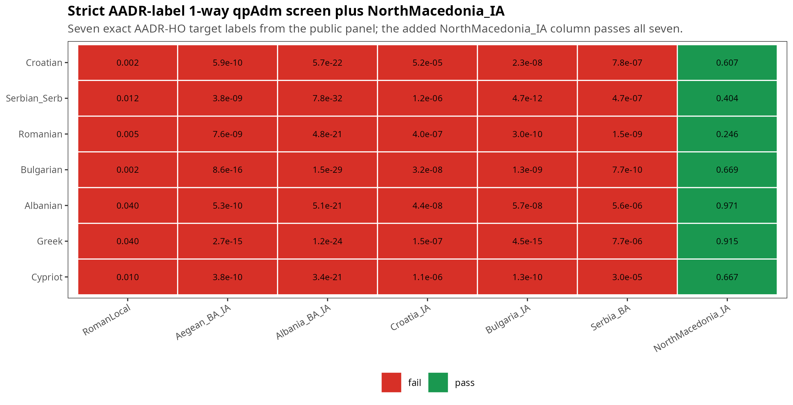

# Comment on "A genetic history of the Balkans from Roman frontier to Slavic migrations": the omitted NorthMacedonia_IA substrate in the 1-source qpAdm screen

This repository accompanies a methodological comment on `Olalde et al. 2023`.
It addresses one narrow question: can the published present-day **1-source**
qpAdm substrate screen be restated on exact public AADR Human Origins target
labels, and what happens if one omitted Iron Age Balkan substrate,
`NorthMacedonia_IA`, is added as a seventh column?

It includes the manuscript source, compiled PDFs, figure outputs, pipeline
scripts, and result tables used for that restatement.

## TL;DR



The strict public-HO target panel retained in this repository is:

- `Croatian`
- `Serbian_Serb`
- `Romanian`
- `Bulgarian`
- `Albanian`
- `Greek`
- `Cypriot`

This repository restates the 1-source screen on those seven exact AADR labels
under the documented Human Origins / `allsnps` setup and then adds
`NorthMacedonia_IA` as a seventh source column. Every published substrate
column still fails every retained target row, while the added
`NorthMacedonia_IA` column passes every retained row.

The claim is narrow but important: the published first-stage local-substrate
screen was not exhaustive even at the simplest level of the model family. A
1-source pass is interpreted only as non-rejection under this right-set; it is
**not** evidence of continuity or literal historical ancestry.

## Read first

- Main manuscript: [`manuscript/main.pdf`](manuscript/main.pdf)
- Supplementary material: [`manuscript/supplementary.pdf`](manuscript/supplementary.pdf)
- Main figure: [`manuscript/figs/fig1_table8_oneway.pdf`](manuscript/figs/fig1_table8_oneway.pdf)
- Core summary table: [`results/table8_oneway_summary.tsv`](results/table8_oneway_summary.tsv)
- Result notes: [`results/NOTES.md`](results/NOTES.md)

## What this comment shows

- The six published local substrate columns still fail on the retained strict
  public-label panel.
- Adding `NorthMacedonia_IA` reverses the 1-source pass/fail pattern on that
  panel.
- One relevant omitted candidate within the same broad temporal and geographic
  frame is sufficient to show that the published screening step was not
  exhaustive.
- The claim is methodological, not genealogical: this is about screening-set
  exhaustiveness, not proof of direct ancestry.

## Repository layout

```text
olalde2023_substrate_comment/
  README.md
  LICENSE
  data/
    cluster_definitions.tsv
  manuscript/
    main.tex
    supplementary.tex
    refs.bib
    main.pdf
    supplementary.pdf
    figs/
    tables/
  results/
    NOTES.md
    T9_allsnps_sensitivity.tsv
    table8_oneway_reproduced_*.tsv
    table8_oneway_with_northmac_*.tsv
    table8_oneway_summary.tsv
    table8_target_panel.tsv
  scripts/
    02_build_ind_and_f2cache.R
    03_qpadm_run.R
    10_figures.R
    11_tables.R
    _paths.R
  work/
    intermediate/
      v66.HO.olalde_repro.{geno,snp,ind}
```

`work/` is a local build area for genotype-derived intermediates and caches. It
is not part of the intended public source tree on GitHub.

## Reproducibility

The pipeline is designed to be reproducible from public inputs within the
limits stated in the manuscript. In particular:

- raw genotype data are not redistributed here
- local `work/` intermediates are not versioned
- compiled PDFs and figure outputs are versioned as reader-friendly deliverables

## Core pipeline

```bash
Rscript scripts/02_build_ind_and_f2cache.R
Rscript scripts/03_qpadm_run.R
Rscript scripts/10_figures.R
Rscript scripts/11_tables.R
```

## Main outputs

- [`manuscript/main.pdf`](manuscript/main.pdf)
- [`manuscript/supplementary.pdf`](manuscript/supplementary.pdf)
- [`manuscript/figs/fig1_table8_oneway.pdf`](manuscript/figs/fig1_table8_oneway.pdf)
- [`manuscript/figs/fig1_table8_oneway.png`](manuscript/figs/fig1_table8_oneway.png)
- [`results/table8_oneway_reproduced_long.tsv`](results/table8_oneway_reproduced_long.tsv)
- [`results/table8_oneway_reproduced_wide.tsv`](results/table8_oneway_reproduced_wide.tsv)
- [`results/table8_oneway_with_northmac_long.tsv`](results/table8_oneway_with_northmac_long.tsv)
- [`results/table8_oneway_with_northmac_wide.tsv`](results/table8_oneway_with_northmac_wide.tsv)
- [`results/table8_oneway_summary.tsv`](results/table8_oneway_summary.tsv)
- [`results/table8_target_panel.tsv`](results/table8_target_panel.tsv)
- [`manuscript/tables/table1_main.tex`](manuscript/tables/table1_main.tex)
- [`manuscript/tables/tableS1_oneway_full.tex`](manuscript/tables/tableS1_oneway_full.tex)
- [`manuscript/tables/tableS2_target_panel.tex`](manuscript/tables/tableS2_target_panel.tex)

The compiled PDFs and figure outputs are versioned in this repository as small,
reader-friendly deliverables alongside the manuscript source.

## Public repo contents

The public GitHub repository is intended to include:

- manuscript source (`manuscript/*.tex`, `manuscript/refs.bib`)
- compiled manuscript deliverables (`manuscript/*.pdf`, `manuscript/figs/*`)
- pipeline scripts (`scripts/*.R`)
- small project data (`data/cluster_definitions.tsv`)
- result tables and summaries (`results/*.tsv`, `results/NOTES.md`)
- generated manuscript tables (`manuscript/tables/*`)

## Data

The analysis uses AADR v66.0 Human Origins (`v66.HO.aadr.PUB.*`). Genotype
data are not redistributed here. See the Harvard Dataverse release cited in
the manuscript.

To rerun the full pipeline, users must provide their own local copy of the AADR
input files and point the scripts to that dataset via the environment variables
documented in [`scripts/_paths.R`](scripts/_paths.R).

## What is not redistributed

The repository does not redistribute:

- AADR genotype files or genotype-derived working prefixes (`*.geno`, `*.snp`,
  `*.ind`, `*.anno`)
- local intermediate caches under `work/`

The checked-in file `results/T9_allsnps_sensitivity.tsv` is retained as a
cached upstream result used by `scripts/03_qpadm_run.R`; it is not raw public
genotype data.

## License

- Code: MIT
- Manuscript text and figures: CC BY 4.0
